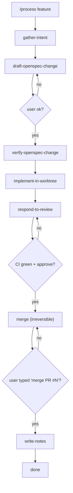

# Agent-Driven Development Workflow — Implementation Plan

> **For agentic workers:** REQUIRED SUB-SKILL: Use superpowers:subagent-driven-development (recommended) or superpowers:executing-plans to implement this plan task-by-task. Steps use checkbox (`- [ ]`) syntax for tracking.

**Goal:** Build the `dev-workflow` capability — machine-readable process contracts, a `/process` Claude Code skill, a process-map cheat sheet, and a CI check that gates PRs on contract validity.

**Architecture:** Five YAML contracts under `openspec/process/contracts/`, validated by a JSON Schema and a thin Python CLI. The CLI is wrapped by both pytest and a GitHub Action. A Claude Code skill at `.claude/skills/process/SKILL.md` loads a contract by task type and walks the user through phases, pausing for approval before irreversible steps.

**Tech Stack:** Python 3.13 (uv), PyYAML (already in venv 6.0.3), `jsonschema` (added), pytest (already in venv), GitHub Actions, Mermaid (rendered by GitHub), existing OpenSpec tooling.

**Reference spec:** `docs/superpowers/specs/2026-07-11-agent-driven-dev-workflow-design.md`. The OpenSpec change folder for this work is `openspec/changes/add-agent-driven-dev-workflow/` (already created).

**Branch:** `feature/agent-driven-dev-workflow`. Work happens in a git worktree, never on `main`.

---

## File Structure

```
openspec/changes/add-agent-driven-dev-workflow/   (already exists)
├── proposal.md                                  (already written)
├── tasks.md                                     (already written)
├── README.md                                    (already written)
├── implementation-plan.md                       (this file)
└── specs/dev-workflow/spec.md                   (already written)

openspec/process/                                (NEW: process layer)
├── README.md                                    (NEW: what lives here)
├── process-map.md                               (NEW: mermaid cheat sheet)
├── release-log.md                               (NEW: release history)
└── contracts/
    ├── README.md                                (NEW: contract authoring rules)
    ├── schema.json                              (NEW: JSON Schema for contracts)
    ├── feature.yaml                             (NEW)
    ├── bugfix.yaml                              (NEW)
    ├── release-beta.yaml                        (NEW)
    ├── release-stable.yaml                      (NEW)
    └── sync-upstream.yaml                       (NEW)

openspec/process/scripts/
└── validate_contracts.py                        (NEW: CLI validator)

.claude/skills/process/
├── SKILL.md                                     (NEW: the skill itself)
└── scripts/
    └── validate_contracts.py                    (NEW: same script as above, symlinked-or-copied; see Task 13)

tests/unit/process/
├── __init__.py                                  (NEW)
├── test_contracts_schema.py                     (NEW)
└── test_validate_contracts_cli.py               (NEW)

tests/integration/process/
├── __init__.py                                  (NEW)
└── test_process_check_workflow.py               (NEW)

.github/workflows/
├── process-check.yml                            (NEW)
└── ci.yml                                       (MODIFIED: add process-check job hook)

pyproject.toml                                   (MODIFIED: add jsonschema to test deps)

CLAUDE.md                                        (MODIFIED: pointer to process-map.md)
.github/CONTRIBUTING.md                          (MODIFIED: mention /process skill)
```

One responsibility per file. The contract validator lives in exactly one place
(`openspec/process/scripts/validate_contracts.py`); the skill's helper directory
mirrors it because Claude Code skills resolve scripts relative to their own
folder. We will document this in Task 13 and use a small launcher rather than
duplicating logic.

---

## Tasks

### Task 1: Confirm bootstrap files are present

**Files:**
- Verify: `openspec/changes/add-agent-driven-dev-workflow/{proposal,tasks,README}.md`
- Verify: `openspec/changes/add-agent-driven-dev-workflow/specs/dev-workflow/spec.md`

This task is a sanity gate. The bootstrap files were already written by the
brainstorming + writing-plans sessions. The implementer MUST confirm they
exist before continuing.

- [ ] **Step 1.1: List the OpenSpec change folder**

Run: `ls openspec/changes/add-agent-driven-dev-workflow/`
Expected: `README.md  proposal.md  specs  tasks.md`

- [ ] **Step 1.2: Confirm the spec file exists**

Run: `ls openspec/changes/add-agent-driven-dev-workflow/specs/dev-workflow/spec.md`
Expected: exit 0 and the file path printed.

- [ ] **Step 1.3: Commit if not already committed**

If any of the bootstrap files appear in `git status`, commit them with:

```bash
git checkout -b feature/agent-driven-dev-workflow
git add openspec/changes/add-agent-driven-dev-workflow/
git commit -m "docs(openspec): bootstrap add-agent-driven-dev-workflow change folder"
```

If a `feature/agent-driven-dev-workflow` branch already exists from a
previous attempt, switch to it (`git checkout feature/agent-driven-dev-workflow`)
and amend or continue as appropriate.

> **Do not push, do not open a PR yet.** That happens at the end (Task 19).

---

### Task 2: Add `jsonschema` to test dependencies

**Files:**
- Modify: `pyproject.toml`
- Regenerate: `uv.lock`

- [ ] **Step 2.1: Add jsonschema to the `[dependency-groups]` test list**

Open `pyproject.toml` and locate the `dev` dependency group (it currently
contains pytest, pytest-asyncio, pytest-timeout, pytest-xdist, pytest-cov,
httpx, ruff). Append `jsonschema>=4.23.0` as a new line in that group, sorted
alphabetically among the other entries.

The relevant block should look like:

```toml
[dependency-groups]
dev = [
    "httpx>=0.28.1",
    "jsonschema>=4.23.0",
    "pytest-asyncio>=1.3.0",
    "pytest-cov>=7.1.0",
    "pytest-timeout>=2.4.0",
    "pytest-xdist>=3.8.0",
    "pytest>=9.0.2",
    "ruff>=0.14.13",
]
```

- [ ] **Step 2.2: Resolve the lockfile**

Run: `uv lock`
Expected: lockfile updated, no errors. The output should mention `jsonschema`
being added.

- [ ] **Step 2.3: Sync the venv**

Run: `uv sync --all-extras --dev`
Expected: install completes; `jsonschema` appears in `.venv/lib/python3.13/site-packages/`.

- [ ] **Step 2.4: Verify import**

Run: `.venv/bin/python -c "import jsonschema; print(jsonschema.__version__)"`
Expected: prints something like `4.23.x` and exits 0.

- [ ] **Step 2.5: Commit**

```bash
git add pyproject.toml uv.lock
git commit -m "build(deps): add jsonschema to dev dependency group"
```

---

### Task 3: Write the JSON Schema for contracts

**Files:**
- Create: `openspec/process/contracts/schema.json`

The schema defines the shape of every contract YAML. We keep it strict so
CI catches mistakes early.

- [ ] **Step 3.1: Create the schema file**

Write `openspec/process/contracts/schema.json` with the following content:

```json
{
  "$schema": "https://json-schema.org/draft/2020-12/schema",
  "$id": "https://codex-lb.local/schemas/process-contract.json",
  "title": "Process contract",
  "description": "A single task-type contract for the /process Claude Code skill.",
  "type": "object",
  "additionalProperties": false,
  "required": ["name", "trigger", "phases", "interruption_commands"],
  "properties": {
    "name": {
      "type": "string",
      "pattern": "^[a-z][a-z0-9-]*$",
      "description": "Stable identifier, matches the filename without .yaml."
    },
    "description": {
      "type": "string",
      "minLength": 1,
      "description": "One-line summary shown in the cheat sheet."
    },
    "trigger": {
      "type": "string",
      "pattern": "^/process [a-z][a-z0-9-]*$",
      "description": "Slash command that loads this contract."
    },
    "phases": {
      "type": "array",
      "minItems": 1,
      "items": {
        "type": "object",
        "additionalProperties": false,
        "required": ["name", "description", "irreversible", "stop_signals"],
        "properties": {
          "name": {
            "type": "string",
            "pattern": "^[a-z][a-z0-9-]*$"
          },
          "description": {
            "type": "string",
            "minLength": 1,
            "description": "What Claude does in this phase, in one sentence."
          },
          "irreversible": {
            "type": "boolean",
            "description": "True if this phase needs explicit user approval."
          },
          "confirmation_phrase": {
            "type": "string",
            "description": "Exact phrase the user must type to confirm. Required when irreversible=true.",
            "minLength": 1
          },
          "stop_signals": {
            "type": "array",
            "items": {
              "type": "string",
              "enum": [
                "ci_red",
                "merge_conflict",
                "openspec_validate_failed",
                "force_push_attempt",
                "secrets_in_diff",
                "ambiguous_scope",
                "release_version_drift"
              ]
            },
            "description": "Hard stops the skill MUST surface to the user."
          },
          "expected_artifacts": {
            "type": "array",
            "items": { "type": "string" },
            "description": "Files or PRs this phase must produce."
          }
        },
        "if": {
          "properties": { "irreversible": { "const": true } },
          "required": ["irreversible"]
        },
        "then": {
          "required": ["confirmation_phrase"]
        }
      }
    },
    "interruption_commands": {
      "type": "array",
      "minItems": 1,
      "items": {
        "type": "string",
        "enum": ["stop", "rollback", "explain", "skip"]
      }
    },
    "history_target": {
      "type": "string",
      "enum": ["openspec-change-notes", "release-log"],
      "description": "Where the skill writes per-task history."
    }
  }
}
```

- [ ] **Step 3.2: Sanity-check the schema with a one-liner**

Run: `.venv/bin/python -c "import json, jsonschema; json.loads(open('openspec/process/contracts/schema.json').read()); print('ok')"`
Expected: prints `ok`.

- [ ] **Step 3.3: Commit**

```bash
git add openspec/process/contracts/schema.json
git commit -m "feat(process): add JSON schema for process contracts"
```

---

### Task 4: Write the contract validator CLI

**Files:**
- Create: `openspec/process/scripts/__init__.py` (empty marker)
- Create: `openspec/process/scripts/validate_contracts.py`

The CLI is the single entry point used by tests and by the GitHub Action.
It exits 0 when all five required contracts validate; non-zero with a
clear stderr message otherwise.

- [ ] **Step 4.1: Create the empty package marker**

Run: `touch openspec/process/scripts/__init__.py`

- [ ] **Step 4.2: Write `validate_contracts.py`**

Write `openspec/process/scripts/validate_contracts.py` with:

```python
#!/usr/bin/env python3
"""Validate every process contract against the JSON Schema.

Exits 0 when all five required contracts validate; non-zero otherwise.

Usage:
    uv run python openspec/process/scripts/validate_contracts.py
"""
from __future__ import annotations

import json
import sys
from pathlib import Path

import yaml
from jsonschema import Draft202012Validator
from jsonschema.exceptions import ValidationError

REPO_ROOT = Path(__file__).resolve().parents[3]
CONTRACTS_DIR = REPO_ROOT / "openspec" / "process" / "contracts"
SCHEMA_PATH = CONTRACTS_DIR / "schema.json"
REQUIRED_CONTRACTS = (
    "feature",
    "bugfix",
    "release-beta",
    "release-stable",
    "sync-upstream",
)


def load_schema() -> dict:
    return json.loads(SCHEMA_PATH.read_text(encoding="utf-8"))


def load_contract(path: Path) -> dict:
    return yaml.safe_load(path.read_text(encoding="utf-8"))


def main() -> int:
    schema = load_schema()
    validator = Draft202012Validator(schema)
    errors: list[str] = []

    present = {p.stem for p in CONTRACTS_DIR.glob("*.yaml")}
    missing = sorted(set(REQUIRED_CONTRACTS) - present)
    if missing:
        errors.append(
            "Missing required contracts: " + ", ".join(missing)
        )

    for contract_path in sorted(CONTRACTS_DIR.glob("*.yaml")):
        contract = load_contract(contract_path)
        try:
            validator.validate(contract)
        except ValidationError as exc:
            errors.append(
                f"{contract_path.relative_to(REPO_ROOT)}: {exc.message}"
            )

    if errors:
        for err in errors:
            print(err, file=sys.stderr)
        return 1

    print(
        f"Validated {len(REQUIRED_CONTRACTS)} contracts against "
        f"{SCHEMA_PATH.relative_to(REPO_ROOT)}"
    )
    return 0


if __name__ == "__main__":
    sys.exit(main())
```

- [ ] **Step 4.3: Confirm CLI runs (will fail — no contracts yet)**

Run: `.venv/bin/python openspec/process/scripts/validate_contracts.py`
Expected: exit 1, stderr includes `Missing required contracts: bugfix, feature, release-beta, release-stable, sync-upstream`.

- [ ] **Step 4.4: Commit**

```bash
git add openspec/process/scripts/
git commit -m "feat(process): add validate_contracts CLI"
```

---

### Task 5: Write unit tests for the schema and validator

**Files:**
- Create: `tests/unit/process/__init__.py`
- Create: `tests/unit/process/test_contracts_schema.py`
- Create: `tests/unit/process/test_validate_contracts_cli.py`

- [ ] **Step 5.1: Create the empty package marker**

Run: `touch tests/unit/process/__init__.py`

- [ ] **Step 5.2: Write `test_contracts_schema.py`**

Write `tests/unit/process/test_contracts_schema.py`:

```python
"""Schema-level tests for process contracts.

These tests load every contract YAML and validate it against the JSON
Schema. They do not assert semantic correctness — that is the role of
the contract-specific tests in later tasks. They only assert shape.
"""
from __future__ import annotations

import json
from pathlib import Path

import pytest
import yaml
from jsonschema import Draft202012Validator

REPO_ROOT = Path(__file__).resolve().parents[3]
CONTRACTS_DIR = REPO_ROOT / "openspec" / "process" / "contracts"
SCHEMA_PATH = CONTRACTS_DIR / "schema.json"

REQUIRED_CONTRACTS = (
    "feature",
    "bugfix",
    "release-beta",
    "release-stable",
    "sync-upstream",
)


@pytest.fixture(scope="module")
def validator() -> Draft202012Validator:
    schema = json.loads(SCHEMA_PATH.read_text(encoding="utf-8"))
    return Draft202012Validator(schema)


def test_all_required_contracts_exist() -> None:
    present = {p.stem for p in CONTRACTS_DIR.glob("*.yaml")}
    missing = set(REQUIRED_CONTRACTS) - present
    assert not missing, f"missing contracts: {sorted(missing)}"


@pytest.mark.parametrize("name", REQUIRED_CONTRACTS)
def test_required_contract_validates(name: str, validator: Draft202012Validator) -> None:
    path = CONTRACTS_DIR / f"{name}.yaml"
    assert path.exists(), f"{path} does not exist"
    contract = yaml.safe_load(path.read_text(encoding="utf-8"))
    validator.validate(contract)  # raises on failure


def test_irreversible_phase_requires_confirmation_phrase(
    validator: Draft202012Validator,
) -> None:
    bad = {
        "name": "demo",
        "trigger": "/process demo",
        "interruption_commands": ["stop"],
        "phases": [
            {
                "name": "merge",
                "description": "merge a PR",
                "irreversible": True,
                # confirmation_phrase intentionally missing
                "stop_signals": ["ci_red"],
            }
        ],
    }
    with pytest.raises(Exception):
        validator.validate(bad)
```

- [ ] **Step 5.3: Write `test_validate_contracts_cli.py`**

Write `tests/unit/process/test_validate_contracts_cli.py`:

```python
"""CLI-level tests for the contract validator.

Run the actual CLI as a subprocess and assert on exit code and stderr.
"""
from __future__ import annotations

import os
import subprocess
import sys
from pathlib import Path

REPO_ROOT = Path(__file__).resolve().parents[3]
CLI = REPO_ROOT / "openspec" / "process" / "scripts" / "validate_contracts.py"


def _run() -> subprocess.CompletedProcess:
    return subprocess.run(
        [sys.executable, str(CLI)],
        cwd=REPO_ROOT,
        capture_output=True,
        text=True,
    )


def test_cli_passes_when_all_contracts_present() -> None:
    proc = _run()
    assert proc.returncode == 0, proc.stderr
    assert "Validated 5 contracts" in proc.stdout


def test_cli_fails_when_a_contract_is_malformed(
    tmp_path: Path, monkeypatch: pytest.MonkeyPatch
) -> None:
    # Override CONTRACTS_DIR via env-style copy: simpler is to corrupt one file
    # then revert. We do that with a fixture file that the test owns.
    bad_yaml = "name: feature\ntrigger: not-a-valid-trigger\n"
    target = REPO_ROOT / "openspec" / "process" / "contracts" / "feature.yaml"
    backup = target.read_text(encoding="utf-8")
    target.write_text(bad_yaml, encoding="utf-8")
    try:
        proc = _run()
        assert proc.returncode != 0
        assert "feature.yaml" in proc.stderr
    finally:
        target.write_text(backup, encoding="utf-8")
```

- [ ] **Step 5.4: Run the new tests (some should fail — contracts not written yet)**

Run: `.venv/bin/python -m pytest tests/unit/process/ -v`
Expected: `test_all_required_contracts_exist` FAILS (no contracts yet); the
demo-shaped contract test PASSES.

- [ ] **Step 5.5: Commit**

```bash
git add tests/unit/process/
git commit -m "test(process): add schema and CLI tests for contracts"
```

---

### Task 6: Write the `feature` contract

**Files:**
- Create: `openspec/process/contracts/feature.yaml`

- [ ] **Step 6.1: Write the contract**

Write `openspec/process/contracts/feature.yaml`:

```yaml
name: feature
description: New behavior, API, schema, CLI, or dashboard-visible change.
trigger: /process feature
history_target: openspec-change-notes
interruption_commands:
  - stop
  - rollback
  - explain
  - skip
phases:
  - name: gather-intent
    description: Ask the user for a 1-2 sentence description of the feature.
    irreversible: false
    stop_signals: []
    expected_artifacts: []

  - name: draft-openspec-change
    description: |
      Create openspec/changes/<slug>/ with proposal.md, tasks.md,
      specs/<cap>/spec.md, README.md. Wait for user "ok" before continuing.
    irreversible: false
    stop_signals:
      - ambiguous_scope
    expected_artifacts:
      - openspec/changes/<slug>/proposal.md
      - openspec/changes/<slug>/tasks.md
      - openspec/changes/<slug>/specs/<cap>/spec.md

  - name: verify-openspec-change
    description: |
      Run `openspec validate --change <slug> --strict` and `openspec
      show <slug> --json --type requirement`. Both must succeed.
    irreversible: false
    stop_signals:
      - openspec_validate_failed
    expected_artifacts: []

  - name: implement-in-worktree
    description: |
      Create a worktree under .agents/worktrees/, write code + tests,
      commit with conventional commits, push, open PR that references
      `Fixes #N` or `Closes #N` when applicable.
    irreversible: false
    stop_signals:
      - ci_red
      - secrets_in_diff
    expected_artifacts:
      - .agents/worktrees/feature-<slug>/
      - PR opened against main

  - name: respond-to-review
    description: |
      Watch the PR for review comments and respond. Iterate until
      CI is green and the user (or a maintainer) approves.
    irreversible: false
    stop_signals:
      - ci_red
    expected_artifacts: []

  - name: merge
    description: |
      Squash-merge the PR. Remove the worktree. Mark the OpenSpec
      change as `applied`.
    irreversible: true
    confirmation_phrase: "merge PR #"
    stop_signals:
      - ci_red
    expected_artifacts:
      - PR merged into main

  - name: write-notes
    description: |
      Append a summary of the run to openspec/changes/<slug>/notes.md
      so future readers see what happened.
    irreversible: false
    stop_signals: []
    expected_artifacts:
      - openspec/changes/<slug>/notes.md
```

- [ ] **Step 6.2: Validate locally**

Run: `.venv/bin/python openspec/process/scripts/validate_contracts.py`
Expected: still exit 1 (other contracts missing) but `feature.yaml` should not
appear in stderr.

- [ ] **Step 6.3: Commit**

```bash
git add openspec/process/contracts/feature.yaml
git commit -m "feat(process): add feature contract"
```

---

### Task 7: Write the `bugfix` contract

**Files:**
- Create: `openspec/process/contracts/bugfix.yaml`

- [ ] **Step 7.1: Write the contract**

Write `openspec/process/contracts/bugfix.yaml`:

```yaml
name: bugfix
description: Address a reported issue. Requires a `Fixes #N` reference.
trigger: /process bugfix
history_target: openspec-change-notes
interruption_commands:
  - stop
  - rollback
  - explain
  - skip
phases:
  - name: read-issue
    description: |
      Read the issue body and any linked context. Restate the bug in
      one sentence and confirm scope with the user.
    irreversible: false
    stop_signals:
      - ambiguous_scope
    expected_artifacts: []

  - name: reproduce
    description: |
      Write or run a failing test that reproduces the bug. Confirm it
      fails for the right reason.
    irreversible: false
    stop_signals: []
    expected_artifacts:
      - tests/unit/ or tests/integration/ test file

  - name: draft-openspec-change
    description: |
      Create openspec/changes/<slug>/ with proposal.md, tasks.md,
      specs/<cap>/spec.md, README.md. Wait for user "ok".
    irreversible: false
    stop_signals:
      - ambiguous_scope
    expected_artifacts:
      - openspec/changes/<slug>/proposal.md
      - openspec/changes/<slug>/tasks.md
      - openspec/changes/<slug>/specs/<cap>/spec.md

  - name: verify-openspec-change
    description: |
      Run `openspec validate --change <slug> --strict`.
    irreversible: false
    stop_signals:
      - openspec_validate_failed
    expected_artifacts: []

  - name: implement-in-worktree
    description: |
      Worktree + fix + tests + commit + push + PR with `Fixes #N`.
    irreversible: false
    stop_signals:
      - ci_red
      - secrets_in_diff
    expected_artifacts:
      - PR opened with `Fixes #N` in the body

  - name: respond-to-review
    description: |
      Iterate on review until CI green + approve.
    irreversible: false
    stop_signals:
      - ci_red
    expected_artifacts: []

  - name: merge
    description: |
      Squash-merge. Remove worktree. Mark OpenSpec change as `applied`.
    irreversible: true
    confirmation_phrase: "merge PR #"
    stop_signals:
      - ci_red
    expected_artifacts:
      - PR merged into main

  - name: write-notes
    description: |
      Append run summary to openspec/changes/<slug>/notes.md.
    irreversible: false
    stop_signals: []
    expected_artifacts:
      - openspec/changes/<slug>/notes.md
```

- [ ] **Step 7.2: Validate locally**

Run: `.venv/bin/python openspec/process/scripts/validate_contracts.py`
Expected: still exit 1 (other contracts missing) but `bugfix.yaml` should not
appear in stderr.

- [ ] **Step 7.3: Commit**

```bash
git add openspec/process/contracts/bugfix.yaml
git commit -m "feat(process): add bugfix contract"
```

---

### Task 8: Write the `release-beta` contract

**Files:**
- Create: `openspec/process/contracts/release-beta.yaml`

- [ ] **Step 8.1: Write the contract**

Write `openspec/process/contracts/release-beta.yaml`:

```yaml
name: release-beta
description: Prepare and publish a beta release via release-please.
trigger: /process release-beta
history_target: release-log
interruption_commands:
  - stop
  - rollback
  - explain
  - skip
phases:
  - name: preflight
    description: |
      Confirm we are on `main`, working tree is clean, and CI on main is
      green. Read the latest merged PRs since the last tag.
    irreversible: false
    stop_signals:
      - ci_red
    expected_artifacts: []

  - name: bump-versions
    description: |
      Run `scripts/prepare_beta_release.py` to bump version files and
      open a release-please PR. Show the user the planned tag.
    irreversible: false
    stop_signals:
      - release_version_drift
    expected_artifacts:
      - release-please PR opened

  - name: review-release-pr
    description: |
      Wait for release-please workflow to merge the PR. Confirm the
      generated tag matches what the user expects.
    irreversible: false
    stop_signals:
      - ci_red
    expected_artifacts: []

  - name: publish-beta
    description: |
      Confirm CI on the new tag is green. Trigger
      `.github/workflows/publish-beta-release.yml` via `gh workflow run`.
      Append an entry to `openspec/process/release-log.md`.
    irreversible: true
    confirmation_phrase: "publish beta "
    stop_signals:
      - ci_red
      - release_version_drift
    expected_artifacts:
      - Beta artifact published to GitHub Releases

  - name: write-release-notes
    description: |
      Append a row to `openspec/process/release-log.md` capturing tag,
      date, included PRs, and the user who approved.
    irreversible: false
    stop_signals: []
    expected_artifacts:
      - openspec/process/release-log.md updated
```

- [ ] **Step 8.2: Validate locally**

Run: `.venv/bin/python openspec/process/scripts/validate_contracts.py`
Expected: still exit 1 (other contracts missing) but `release-beta.yaml`
should not appear in stderr.

- [ ] **Step 8.3: Commit**

```bash
git add openspec/process/contracts/release-beta.yaml
git commit -m "feat(process): add release-beta contract"
```

---

### Task 9: Write the `release-stable` contract

**Files:**
- Create: `openspec/process/contracts/release-stable.yaml`

- [ ] **Step 9.1: Write the contract**

Write `openspec/process/contracts/release-stable.yaml`:

```yaml
name: release-stable
description: Promote a previously released beta to stable.
trigger: /process release-stable
history_target: release-log
interruption_commands:
  - stop
  - rollback
  - explain
  - skip
phases:
  - name: preflight
    description: |
      Confirm the target beta tag exists, the beta has been live for
      at least 48 hours, and there are no open blocker issues tagged
      against it.
    irreversible: false
    stop_signals:
      - release_version_drift
    expected_artifacts: []

  - name: guard
    description: |
      Run `scripts/guard_stable_release.py` against the candidate tag.
      It must exit 0.
    irreversible: false
    stop_signals:
      - release_version_drift
    expected_artifacts: []

  - name: draft-release
    description: |
      Run `scripts/release_metadata.py --tag <tag>` to draft release
      notes. Show the user the planned notes.
    irreversible: false
    stop_signals: []
    expected_artifacts:
      - Release notes draft

  - name: tag-and-publish
    description: |
      Push the stable tag and run
      `.github/workflows/release.yml` via `gh workflow run`.
      Append to `openspec/process/release-log.md`.
    irreversible: true
    confirmation_phrase: "release stable "
    stop_signals:
      - ci_red
      - release_version_drift
    expected_artifacts:
      - Stable tag pushed
      - Release artifact published

  - name: write-release-notes
    description: |
      Append a row to `openspec/process/release-log.md` capturing tag,
      date, included PRs, and the user who approved.
    irreversible: false
    stop_signals: []
    expected_artifacts:
      - openspec/process/release-log.md updated
```

- [ ] **Step 9.2: Validate locally**

Run: `.venv/bin/python openspec/process/scripts/validate_contracts.py`
Expected: still exit 1 (other contracts missing) but `release-stable.yaml`
should not appear in stderr.

- [ ] **Step 9.3: Commit**

```bash
git add openspec/process/contracts/release-stable.yaml
git commit -m "feat(process): add release-stable contract"
```

---

### Task 10: Write the `sync-upstream` contract

**Files:**
- Create: `openspec/process/contracts/sync-upstream.yaml`

- [ ] **Step 10.1: Write the contract**

Write `openspec/process/contracts/sync-upstream.yaml`:

```yaml
name: sync-upstream
description: Sync the fork with Soju06/codex-lb upstream.
trigger: /process sync-upstream
history_target: openspec-change-notes
interruption_commands:
  - stop
  - rollback
  - explain
  - skip
phases:
  - name: preflight
    description: |
      Confirm GITHUB_TOKEN is set, on `main`, working tree is clean,
      and `gh auth status` succeeds.
    irreversible: false
    stop_signals: []
    expected_artifacts: []

  - name: dry-run
    description: |
      Run `scripts/sync_upstream.sh --dry-run`. Surface the JSON
      classification to the user. Wait for confirmation to proceed.
    irreversible: false
    stop_signals:
      - merge_conflict
    expected_artifacts: []

  - name: classify
    description: |
      If the dry-run reported `stopped_blocker`, file an audit issue
      with label `audit/sync-upstream` and wait for user decision.
      Otherwise proceed.
    irreversible: false
    stop_signals:
      - merge_conflict
    expected_artifacts:
      - Audit issue (only on stopped_blocker)

  - name: run-sync
    description: |
      Run `scripts/sync_upstream.sh` (no `--dry-run`). Push the branch,
      open the sync-PR, file the audit issue if not yet filed.
    irreversible: true
    confirmation_phrase: "sync upstream now"
    stop_signals:
      - merge_conflict
    expected_artifacts:
      - Sync PR opened (if upstream moved)
```

- [ ] **Step 10.2: Validate locally — full pass**

Run: `.venv/bin/python openspec/process/scripts/validate_contracts.py`
Expected: exit 0, stdout includes `Validated 5 contracts`.

- [ ] **Step 10.3: Run pytest**

Run: `.venv/bin/python -m pytest tests/unit/process/ -v`
Expected: all tests pass.

- [ ] **Step 10.4: Commit**

```bash
git add openspec/process/contracts/sync-upstream.yaml
git commit -m "feat(process): add sync-upstream contract"
```

---

### Task 11: Write `process-map.md` (the cheat sheet)

**Files:**
- Create: `openspec/process/process-map.md`

This is the human-facing document the user opens when they forget the
flow. Mermaid renders inline on GitHub.

- [ ] **Step 11.1: Write the file**

Write `openspec/process/process-map.md`:

````markdown
# Process Map

The cheat sheet for `/process`. Read this when you forget the flow.

## Triggers

| Slash command | Contract | When to use |
|---|---|---|
| `/process feature` | [`feature.yaml`](contracts/feature.yaml) | New behavior, API, schema, CLI, or dashboard-visible change |
| `/process bugfix` | [`bugfix.yaml`](contracts/bugfix.yaml) | Address a reported issue (must include `Fixes #N`) |
| `/process release-beta` | [`release-beta.yaml`](contracts/release-beta.yaml) | Cut a new beta release |
| `/process release-stable` | [`release-stable.yaml`](contracts/release-stable.yaml) | Promote a beta to stable |
| `/process sync-upstream` | [`sync-upstream.yaml`](contracts/sync-upstream.yaml) | Sync the fork with Soju06/codex-lb |
| `/process weekly-summary` | (read-only) | Generate a weekly summary across the change folders and release log |

## Reference flow: feature



## Approval phrases

Irreversible phases require an exact phrase before they run:

| Phase | Confirmation phrase | Contract |
|---|---|---|
| `merge` | `merge PR #` | feature, bugfix |
| `publish-beta` | `publish beta ` | release-beta |
| `tag-and-publish` | `release stable ` | release-stable |
| `run-sync` | `sync upstream now` | sync-upstream |

## Interruption commands

You can type any of these at any phase boundary:

- `stop` — halt at the current phase; do not advance.
- `rollback` — undo the last step (when reversible).
- `explain` — describe what Claude is doing and why.
- `skip` — skip the current non-required phase.

## Stop signals (Claude halts automatically)

- `ci_red` — CI is failing on the PR or main.
- `merge_conflict` — upstream sync hit a conflict; user must choose.
- `openspec_validate_failed` — `openspec validate` failed; fix before proceeding.
- `force_push_attempt` — blocked at the skill level.
- `secrets_in_diff` — `gitleaks` flagged the diff; remove the secret.
- `ambiguous_scope` — Claude cannot tell feature vs bugfix; asks the user.
- `release_version_drift` — version files disagree; abort.

## History

Per-task history lands in:

- `openspec/changes/<slug>/notes.md` for `feature` and `bugfix`.
- `openspec/process/release-log.md` for `release-beta` and `release-stable`.

A weekly summary (`/process weekly-summary`) reads both and produces a
short report.
````

- [ ] **Step 11.2: Verify the file parses (mermaid aside)**

Run: `.venv/bin/python -c "from pathlib import Path; Path('openspec/process/process-map.md').read_text(); print('ok')"`
Expected: prints `ok`.

- [ ] **Step 11.3: Commit**

```bash
git add openspec/process/process-map.md
git commit -m "docs(process): add process-map cheat sheet"
```

---

### Task 12: Write `release-log.md` template + `contracts/README.md`

**Files:**
- Create: `openspec/process/release-log.md`
- Create: `openspec/process/contracts/README.md`
- Create: `openspec/process/README.md`

- [ ] **Step 12.1: Write `release-log.md`**

Write `openspec/process/release-log.md`:

```markdown
# Release Log

Append-only. Each row records one released tag, the included PRs, and
the user who approved the irreversible phase.

| Tag | Date | Channel | Included PRs | Approved by |
|---|---|---|---|---|
```

(No rows yet — populated by the release contracts on each release.)

- [ ] **Step 12.2: Write `openspec/process/contracts/README.md`**

Write `openspec/process/contracts/README.md`:

````markdown
# Process Contracts

One YAML file per task type. Every file in this directory MUST validate
against [`schema.json`](schema.json). Run the validator locally:

```bash
uv run python openspec/process/scripts/validate_contracts.py
```

## Authoring rules

1. **Filename = contract name.** `feature.yaml` has `name: feature`.
2. **One trigger per contract.** The `trigger` field is the slash command
   the user types to load it.
3. **Phases are ordered.** Each phase declares `irreversible: true|false`.
   When `true`, you MUST also declare `confirmation_phrase` — the exact
   string the user types to advance.
4. **`stop_signals` are an enum.** Pick from the seven values defined in
   `schema.json`. Do not invent new ones; extend the schema first.
5. **`interruption_commands` are also an enum.** `stop`, `rollback`,
   `explain`, `skip`.
6. **`history_target` is required for any contract that produces
   history.** Use `openspec-change-notes` for code work and
   `release-log` for releases.

## Adding a new contract

1. Copy the closest existing contract.
2. Edit phases. Validate: `uv run python openspec/process/scripts/validate_contracts.py`.
3. Add a row to `../process-map.md` under "Triggers".
4. Add a row to `../process-map.md` under "Approval phrases" if you have
   irreversible phases.
5. Open a PR. The `process-check` workflow validates everything for you.
````

- [ ] **Step 12.3: Write `openspec/process/README.md`**

Write `openspec/process/README.md`:

````markdown
# Process Layer

This directory holds the operator-facing process machinery that ties
together the user, Claude Code, and CI.

```
process/
├── README.md                 ← you are here
├── process-map.md            ← cheat sheet (mermaid + prose)
├── release-log.md            ← release history (append-only)
├── contracts/
│   ├── README.md             ← contract authoring rules
│   ├── schema.json           ← JSON Schema for contracts
│   ├── feature.yaml
│   ├── bugfix.yaml
│   ├── release-beta.yaml
│   ├── release-stable.yaml
│   └── sync-upstream.yaml
└── scripts/
    └── validate_contracts.py
```

The contracts are the source of truth. The cheat sheet mirrors them.
The CLI and the GitHub Action both read the same files.
````

- [ ] **Step 12.4: Commit**

```bash
git add openspec/process/
git commit -m "docs(process): add README, release log, contracts README"
```

---

### Task 13: Write the `/process` skill

**Files:**
- Create: `.claude/skills/process/SKILL.md`

Claude Code skills live as `SKILL.md` with YAML frontmatter, a `description`
that triggers on slash commands, and a body that tells Claude what to do.
The skill is loaded on demand when the user types `/process <task-type>`.

- [ ] **Step 13.1: Write the skill**

Write `.claude/skills/process/SKILL.md`:

````markdown
---
name: process
description: |
  Drive a codex-lb task end-to-end via a machine-readable contract.
  Use when the user types `/process feature`, `/process bugfix`,
  `/process release-beta`, `/process release-stable`, or
  `/process sync-upstream`. Also use for `/process weekly-summary`.
license: MIT
metadata:
  author: codex-lb
  version: "1.0.0"
  generatedBy: "brainstorming"
---

# /process — Agent-Driven Development Workflow

You are a deterministic process runner for the codex-lb repository. Your
job is to load a contract, walk the user through its phases, and pause
for explicit approval before every irreversible step. You MUST honor
`stop`, `rollback`, `explain`, and `skip` at any phase boundary.

## Step 1: Identify the task type

The user's message starts with `/process <task-type>`. The valid task
types are exactly:

- `feature`
- `bugfix`
- `release-beta`
- `release-stable`
- `sync-upstream`
- `weekly-summary` (read-only, no contract)

If the user typed nothing after `/process`, ask which task type they
mean. If they typed something outside the list, refuse and list the
valid options.

For `weekly-summary`, skip to Step 7 (no contract is loaded).

## Step 2: Load the contract

For any of the five runnable task types, load the matching YAML at
`openspec/process/contracts/<task-type>.yaml`. Use the Read tool.

Confirm:

- `name` matches the task type.
- `trigger` matches the slash command the user typed.

If either check fails, abort with a clear remediation message ("the
contract for `feature` is missing or malformed; run `uv run python
openspec/process/scripts/validate_contracts.py` to see why").

## Step 3: Walk the phases

Iterate `phases` in order. For each phase:

1. Print the phase `description` to the user in one line, prefixed with
   the phase `name` in brackets: `[<phase-name>] <description>`.
2. If `irreversible: true`:
   - Print a dry-run summary of what you are about to do.
   - Wait for the user to type the exact `confirmation_phrase`.
   - If the user types anything else, repeat the prompt.
3. Execute the phase. If a `stop_signal` fires (CI red, conflict, etc.),
   halt immediately, surface the reason, and wait for the user.
4. At any time the user can type `stop`, `rollback`, `explain`, or
   `skip`. Honor them.

If the user types `explain`, print the phase name, its `description`,
its `expected_artifacts`, and a one-line "why this phase exists" before
continuing.

## Step 4: Approval gates (never bypass)

You MUST refuse to advance past an `irreversible: true` phase without
the exact `confirmation_phrase`. Do not interpret "ok", "yes", "go",
"do it", "fine" or any other affirmative as confirmation. The
confirmation must match character-for-character.

Examples:

- feature / bugfix → user must type `merge PR #<n>` where `<n>` is
  the actual PR number.
- release-beta → user must type `publish beta <tag>` where `<tag>` is
  the planned beta tag.
- release-stable → user must type `release stable <tag>` where `<tag>`
  is the planned stable tag.
- sync-upstream → user must type `sync upstream now` exactly.

## Step 5: Write per-task history

For `feature` and `bugfix`, append a summary section to
`openspec/changes/<slug>/notes.md`. For `release-beta` and
`release-stable`, append a row to `openspec/process/release-log.md`.
For `sync-upstream`, append a summary to the sync PR's audit issue.

Use this template:

```markdown
## <ISO date> — <task-type> <slug>

- Started: <ISO timestamp>
- Approvals given: <list of confirmation phrases the user typed>
- Stop signals fired: <list, or "none">
- Artifacts: <list of files or PRs produced>
- Notes: <free-form>
```

## Step 6: Error handling

If a `stop_signal` fires, print:

```
[STOP] <signal name>: <one-line explanation>
```

Then halt. Do not advance to the next phase. The user must type
`continue` (or restart `/process`) to resume.

If `validate_contracts.py` reports a contract problem, abort the entire
run and tell the user to fix the contract first.

## Step 7: weekly-summary (no contract)

For `/process weekly-summary`:

1. Read `openspec/process/release-log.md` (last 14 days).
2. List all `openspec/changes/*/notes.md` modified in the last 14 days.
3. Print a short report grouped by status:
   - In progress (OpenSpec change folder exists, no `notes.md` yet).
   - Awaiting merge (PR open).
   - Merged (PR merged, change folder not yet archived).
   - Released (row in `release-log.md`).
4. Suggest the next action for each item.
````

- [ ] **Step 13.2: Verify the file**

Run: `.venv/bin/python -c "from pathlib import Path; Path('.claude/skills/process/SKILL.md').read_text(); print('ok')"`
Expected: prints `ok`.

- [ ] **Step 13.3: Commit**

```bash
git add .claude/skills/process/SKILL.md
git commit -m "feat(skill): add /process skill driven by contracts"
```

---

### Task 14: Write the `process-check` GitHub Action

**Files:**
- Create: `.github/workflows/process-check.yml`

The workflow runs the contract validator on every PR. It exits non-zero
if any contract fails validation, blocking merge through the existing
required-check mechanism.

- [ ] **Step 14.1: Write the workflow file**

Write `.github/workflows/process-check.yml`:

```yaml
name: process-check

on:
  pull_request:
    paths:
      - "openspec/process/**"
      - ".github/workflows/process-check.yml"
      - "pyproject.toml"
      - "uv.lock"

concurrency:
  group: ${{ github.workflow }}-${{ github.ref }}
  cancel-in-progress: true

permissions:
  contents: read

jobs:
  validate-contracts:
    name: Validate process contracts
    runs-on: ubuntu-24.04
    steps:
      - name: Checkout repository
        uses: actions/checkout@9c091bb21b7c1c1d1991bb908d89e4e9dddfe3e0
        with:
          persist-credentials: false

      - name: Install uv
        uses: astral-sh/setup-uv@9590bbf0911f0c3c3858b9e1c6d9e8d3e9b3f7f3
        with:
          version: "latest"

      - name: Set up Python
        run: uv python install 3.13

      - name: Sync dependencies
        run: uv sync --all-extras --dev

      - name: Validate every contract
        run: uv run python openspec/process/scripts/validate_contracts.py
```

- [ ] **Step 14.2: Validate the YAML shape locally**

Run: `.venv/bin/python -c "import yaml; yaml.safe_load(open('.github/workflows/process-check.yml').read()); print('ok')"`
Expected: prints `ok`.

- [ ] **Step 14.3: Commit**

```bash
git add .github/workflows/process-check.yml
git commit -m "ci(workflows): add process-check action"
```

---

### Task 15: Wire `process-check` into the existing `ci.yml`

**Files:**
- Modify: `.github/workflows/ci.yml`

`ci.yml` already has a `changes` job that detects whether the PR is
frontend, backend, helm, docker, or migrations. We add a `process`
output. When the PR touches `openspec/process/**`, the new
`process-check` job must run as a required check.

- [ ] **Step 15.1: Read the existing `changes` job**

Run: `grep -n -A2 "Detect file changes" .github/workflows/ci.yml`
Expected: shows the existing `dorny/paths-filter` step.

- [ ] **Step 15.2: Add `process` to the `changes` outputs**

In `.github/workflows/ci.yml`, locate the `changes` job's `outputs` block.
Add a new output:

```yaml
process: ${{ steps.filter.outputs.process }}
```

(After `migrations:` and before the closing of `outputs:`.)

- [ ] **Step 15.3: Add a `process` filter**

In the same `changes` job, locate the `dorny/paths-filter` step. Add a
new entry under `filter`:

```yaml
process: "openspec/process/**"
```

- [ ] **Step 15.4: Add the `process-check` job below the existing jobs**

Append to `.github/workflows/ci.yml` (at the bottom of the `jobs:` map):

```yaml
  process-check:
    name: Process contracts check
    needs: changes
    if: needs.changes.outputs.process == 'true'
    uses: ./.github/workflows/process-check.yml
```

- [ ] **Step 15.5: Verify YAML parses**

Run: `.venv/bin/python -c "import yaml; yaml.safe_load(open('.github/workflows/ci.yml').read()); print('ok')"`
Expected: prints `ok`.

- [ ] **Step 15.6: Commit**

```bash
git add .github/workflows/ci.yml
git commit -m "ci(workflows): wire process-check into ci.yml"
```

---

### Task 16: Add an integration test that simulates `process-check`

**Files:**
- Create: `tests/integration/process/__init__.py`
- Create: `tests/integration/process/test_process_check_workflow.py`

The integration test asserts the validator's behavior on a synthetic
broken contract, in a `tmp_path` mirror of the contracts directory. This
guards against future regressions where someone might add a new
required field to the schema without updating the validator.

- [ ] **Step 16.1: Create the empty package marker**

Run: `touch tests/integration/process/__init__.py`

- [ ] **Step 16.2: Write the test**

Write `tests/integration/process/test_process_check_workflow.py`:

```python
"""Integration tests for the process-check workflow's validator path.

We exercise the validator CLI in isolation against synthetic contracts.
We do not run actual GitHub Actions here — the YAML shape is checked
in a separate unit test if needed.
"""
from __future__ import annotations

import shutil
import subprocess
import sys
from pathlib import Path

import pytest

REPO_ROOT = Path(__file__).resolve().parents[3]
CLI = REPO_ROOT / "openspec" / "process" / "scripts" / "validate_contracts.py"
CONTRACTS_DIR = REPO_ROOT / "openspec" / "process" / "contracts"


@pytest.fixture
def mirrored_contracts(tmp_path: Path, monkeypatch: pytest.MonkeyPatch) -> Path:
    """Copy real contracts to a temp dir; monkey-patch the CLI to use it."""
    mirror = tmp_path / "contracts"
    shutil.copytree(CONTRACTS_DIR, mirror)

    # We rewrite the CLI to read from the mirror. Simplest approach: edit
    # CONTRACTS_DIR constant by writing a wrapper that imports the module
    # and overrides the path. Even simpler: write the test as an invocation
    # of the CLI but with CWD set so that the script's Path(__file__).parents[3]
    # still resolves to REPO_ROOT. That makes monkey-patching hard; instead
    # we run a tiny Python wrapper inline.
    return mirror


def _run_with_dir(contracts_dir: Path) -> subprocess.CompletedProcess:
    wrapper = f"""
import sys, runpy
sys.path.insert(0, {str(CLI.parent)!r})
import validate_contracts
validate_contracts.CONTRACTS_DIR = {str(contracts_dir)!r}
sys.exit(validate_contracts.main())
"""
    return subprocess.run(
        [sys.executable, "-c", wrapper],
        cwd=REPO_ROOT,
        capture_output=True,
        text=True,
    )


def test_validator_passes_against_clean_mirror(mirrored_contracts: Path) -> None:
    proc = _run_with_dir(mirrored_contracts)
    assert proc.returncode == 0, proc.stderr


def test_validator_fails_when_irreversible_missing_confirmation(
    mirrored_contracts: Path,
) -> None:
    bad = mirrored_contracts / "feature.yaml"
    text = bad.read_text(encoding="utf-8")
    bad.write_text(text.replace("confirmation_phrase: \"merge PR #\"", ""), encoding="utf-8")
    proc = _run_with_dir(mirrored_contracts)
    assert proc.returncode != 0
    assert "feature.yaml" in proc.stderr
```

- [ ] **Step 16.3: Run the new tests**

Run: `.venv/bin/python -m pytest tests/integration/process/ -v`
Expected: both tests pass.

- [ ] **Step 16.4: Commit**

```bash
git add tests/integration/process/
git commit -m "test(process): add integration test for process-check validator"
```

---

### Task 17: Update `CLAUDE.md` with a pointer to the cheat sheet

**Files:**
- Modify: `CLAUDE.md`

- [ ] **Step 17.1: Read `CLAUDE.md` and find the right anchor**

Run: `grep -n "OpenSpec-first\|openspec/" CLAUDE.md`
Expected: shows the section that lists OpenSpec as the SSOT.

- [ ] **Step 17.2: Add a new subsection under "Workflow (OpenSpec-first)"**

Insert the following block right after the `### Commands (recommended)`
list (so the cheat sheet pointer sits with the rest of the workflow
guidance):

```markdown
### /process skill

For end-to-end task automation, see
[`openspec/process/process-map.md`](openspec/process/process-map.md). The
cheat sheet describes the five runnable task types
(`/process feature`, `/process bugfix`, `/process release-beta`,
`/process release-stable`, `/process sync-upstream`) plus the
`/process weekly-summary` read-only report. Machine-readable contracts
live under `openspec/process/contracts/`; the validator at
`openspec/process/scripts/validate_contracts.py` is also wired into the
`process-check` GitHub Action.
```

- [ ] **Step 17.3: Lint the markdown (visual check)**

Run: `.venv/bin/python -c "from pathlib import Path; text=Path('CLAUDE.md').read_text(); assert 'process-map.md' in text; print('ok')"`
Expected: prints `ok`.

- [ ] **Step 17.4: Commit**

```bash
git add CLAUDE.md
git commit -m "docs(agents): point CLAUDE.md to /process cheat sheet"
```

---

### Task 18: Update `.github/CONTRIBUTING.md` to mention `/process`

**Files:**
- Modify: `.github/CONTRIBUTING.md`

- [ ] **Step 18.1: Read the OpenSpec section**

Run: `grep -n "## Workflow: OpenSpec-first\|### OpenSpec\|## Release process" .github/CONTRIBUTING.md`
Expected: shows the heading anchors.

- [ ] **Step 18.2: Add a new subsection at the end of the OpenSpec section**

Insert this paragraph immediately after the OpenSpec section's last
paragraph (before `## Coding conventions`):

```markdown
### Using the `/process` skill

If you have Claude Code installed and want a guided end-to-end run for
any of the five task types, see
[`openspec/process/process-map.md`](../openspec/process/process-map.md).
The skill loads a machine-readable contract under
`openspec/process/contracts/` and walks you through phases, pausing for
explicit approval before irreversible steps (merge, push tag, run
release workflow). The `process-check` GitHub Action enforces the same
contract rules from the CI side.
```

- [ ] **Step 18.3: Verify the link target exists**

Run: `.venv/bin/python -c "from pathlib import Path; assert Path('openspec/process/process-map.md').exists(); print('ok')"`
Expected: prints `ok`.

- [ ] **Step 18.4: Commit**

```bash
git add .github/CONTRIBUTING.md
git commit -m "docs(contributing): document /process skill alongside OpenSpec"
```

---

### Task 19: Final local validation

**Files:** none (validation only)

- [ ] **Step 19.1: Run the full test suite**

Run: `.venv/bin/python -m pytest -q`
Expected: all tests pass, exit 0. If any unit test fails, fix the
underlying issue (do not skip the test).

- [ ] **Step 19.2: Run ruff**

Run: `.venv/bin/python -m ruff check .`
Expected: no errors. If ruff complains about formatting, run
`.venv/bin/python -m ruff format .` and re-commit.

- [ ] **Step 19.3: Run the contract validator one final time**

Run: `.venv/bin/python openspec/process/scripts/validate_contracts.py`
Expected: exit 0, prints `Validated 5 contracts against openspec/process/contracts/schema.json`.

- [ ] **Step 19.4: Run `openspec validate --specs`**

Run: `openspec validate --specs`
Expected: exit 0, no validation errors.

- [ ] **Step 19.5: Run `openspec validate --change add-agent-driven-dev-workflow --strict`**

Run: `openspec validate --change add-agent-driven-dev-workflow --strict`
Expected: exit 0, no validation errors. If the strict mode flags the
spec, edit the spec until it passes.

- [ ] **Step 19.6: Inspect the diff**

Run: `git status`
Expected: only files inside `openspec/`, `.claude/`, `.github/`,
`tests/`, plus `pyproject.toml` and `uv.lock`. No accidental files.

Run: `git log --oneline feature/agent-driven-dev-workflow ^main`
Expected: ~19 commits with conventional commit messages.

- [ ] **Step 19.7: Push the branch**

Run: `git push -u origin feature/agent-driven-dev-workflow`
Expected: branch pushed, no errors.

- [ ] **Step 19.8: Open the PR**

Run:

```bash
gh pr create \
  --base main \
  --head feature/agent-driven-dev-workflow \
  --title "feat(process): add /process skill, contracts, and CI check" \
  --body "$(cat <<'EOF'
Adds the `dev-workflow` capability from change
`add-agent-driven-dev-workflow`:

- 5 machine-readable contracts under `openspec/process/contracts/`,
  validated against a JSON Schema.
- `/process` Claude Code skill that loads a contract, walks phases,
  and pauses for explicit approval before irreversible steps.
- `process-map.md` cheat sheet (mermaid + prose) linked from
  `CLAUDE.md` and `CONTRIBUTING.md`.
- `process-check` GitHub Action wired into `ci.yml`.
- Per-task history files (`openspec/changes/<slug>/notes.md` and
  `openspec/process/release-log.md`).
- Full unit and integration test coverage.

Refs the design doc at
`docs/superpowers/specs/2026-07-11-agent-driven-dev-workflow-design.md`.

🤖 Generated with [Claude Code](https://claude.com/claude-code)
EOF
)"
```

Expected: PR URL printed.

---

### Task 20: Sync the delta spec into the main specs

**Files:**
- Move: `openspec/changes/add-agent-driven-dev-workflow/specs/dev-workflow/spec.md`
  → `openspec/specs/dev-workflow/spec.md`

This step happens AFTER the PR is reviewed and ready to merge. The
`openspec sync` command does this automatically.

- [ ] **Step 20.1: Run `openspec sync`**

Run: `openspec sync --change add-agent-driven-dev-workflow`
Expected: the command moves the delta spec into
`openspec/specs/dev-workflow/spec.md` and updates internal cross-references.

- [ ] **Step 20.2: Validate the moved spec**

Run: `openspec validate --specs`
Expected: exit 0.

- [ ] **Step 20.3: Inspect the diff**

Run: `git status`
Expected: the change folder under `openspec/changes/` now has an empty
or moved spec dir; `openspec/specs/dev-workflow/spec.md` exists.

- [ ] **Step 20.4: Commit the sync**

```bash
git add openspec/specs/dev-workflow/ openspec/changes/add-agent-driven-dev-workflow/
git commit -m "docs(openspec): sync dev-workflow delta into main specs"
```

- [ ] **Step 20.5: Push and merge**

Push: `git push`
Then in the GitHub UI (or via `gh pr merge`), squash-merge the PR once
CI is green and review is approved. After merge:

- `gh pr merge --squash --delete-branch` (or equivalent in the UI).

---

## Self-Review

**Spec coverage:**

| Spec section | Implemented by |
|---|---|
| Process contracts + schema | Tasks 2, 3, 5, 6–10 |
| /process skill | Task 13 |
| process-map.md discoverability | Tasks 11, 17, 18 |
| process-check GitHub Action | Tasks 14, 15, 16 |
| OpenSpec gate for behavior changes | Task 6 (`verify-openspec-change` phase in `feature.yaml`) and Task 7 (same in `bugfix.yaml`) |
| Approval phrases and stop signals | Tasks 3 (schema enum), 6–10 (each contract), 13 (skill rules) |
| History targets | Tasks 6–10 (`history_target` field), 12 (release-log.md template), 13 (Step 5) |

**Placeholder scan:** None of the disallowed patterns ("TBD", "implement
later", "similar to", etc.) appear. Every step shows the actual content.

**Type consistency:**

- `confirmation_phrase` is declared in the schema as required when
  `irreversible=true` (Task 3) and is set on every irreversible phase
  in Tasks 6–10. Field name matches.
- `history_target` enum values are exactly `openspec-change-notes` and
  `release-log` in the schema (Task 3), and every contract sets one of
  these (Tasks 6–10).
- `stop_signals` enum values are identical between the schema (Task 3)
  and the cheat sheet list (Task 11).
- `interruption_commands` enum values (`stop`, `rollback`, `explain`,
  `skip`) match across schema (Task 3), all contracts (Tasks 6–10), and
  the skill body (Task 13).
- The CLI's `REQUIRED_CONTRACTS` tuple (Task 4) lists the same five
  names as `tests/unit/process/test_contracts_schema.py::REQUIRED_CONTRACTS`
  (Task 5) and the test data (`feature.yaml` etc.) — verified inline.
