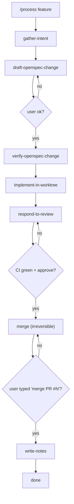

# Process Map

The cheat sheet for `/process`. Read this when you forget the flow.

## Triggers

| Slash command | Contract | When to use |
|---|---|---|
| `/process feature` | [`feature.yaml`](contracts/feature.yaml) | New behavior, API, schema, CLI, or dashboard-visible change |
| `/process bugfix` | [`bugfix.yaml`](contracts/bugfix.yaml) | Address a reported issue (must include `Fixes #N`) |
| `/process release-beta` | [`release-beta.yaml`](contracts/release-beta.yaml) | Cut a new beta release |
| `/process release-stable` | [`release-stable.yaml`](contracts/release-stable.yaml) | Promote a beta to stable |
| `/process sync-upstream` | [`sync-upstream.yaml`](contracts/sync-upstream.yaml) | Sync the fork with Soju06/codex-lb |
| `/process weekly-summary` | (read-only) | Generate a weekly summary across the change folders and release log |

## Reference flow: feature

## Approval phrases

Irreversible phases require an exact phrase before they run:

| Phase | Confirmation phrase | Contract |
|---|---|---|
| `merge` | `merge PR #` | feature, bugfix |
| `publish-beta` | `publish beta ` | release-beta |
| `tag-and-publish` | `release stable ` | release-stable |
| `run-sync` | `sync upstream now` | sync-upstream |

## Interruption commands

You can type any of these at any phase boundary:

- `stop` — halt at the current phase; do not advance.
- `rollback` — undo the last step (when reversible).
- `explain` — describe what Claude is doing and why.
- `skip` — skip the current non-required phase.

## Stop signals (Claude halts automatically)

- `ci_red` — CI is failing on the PR or main.
- `merge_conflict` — upstream sync hit a conflict; user must choose.
- `openspec_validate_failed` — `openspec validate` failed; fix before proceeding.
- `force_push_attempt` — blocked at the skill level.
- `secrets_in_diff` — `gitleaks` flagged the diff; remove the secret.
- `ambiguous_scope` — Claude cannot tell feature vs bugfix; asks the user.
- `release_version_drift` — version files disagree; abort.

## History

Per-task history lands in:

- `openspec/changes/<slug>/notes.md` for `feature` and `bugfix`.
- `openspec/process/release-log.md` for `release-beta` and `release-stable`.

A weekly summary (`/process weekly-summary`) reads both and produces a
short report.